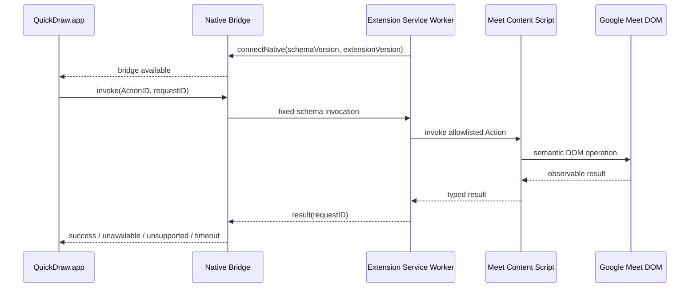

# ADR-0001: Browser ExtensionをQuickDrawのAdapterとして同一リポジトリで管理する

- Status: Accepted
- Date: 2026-08-10
- Scope: Google Meet Level 2 / Browser Extension / repository layout

## Context

QuickDraw.appはmacOS全体でTriggerを受け取り、Actionへ変換し、ForegroundのApplicationに適した実行方式を選ぶ。Google MeetのLevel 1 Actionは公式キーボードショートカットで実行できる。一方、Meeting Reactionなど公式ショートカットがないWeb内部Actionでは、macOS側から次の情報を安定して扱いにくい。

- DOM上の具体的な操作対象
- 会議参加前、参加中、Reaction無効などの状態
- Action実行後の成功確認
- 複数Meet Tabの識別

Chrome Extensionはoriginを限定したContent Scriptからこれらを扱える。ただし、Extensionにも独自のTrigger、Action設定、Profileを持たせると、QuickDraw.appと設定・Routing・Diagnosticsが二重化する。

## Decision

### 1. QuickDraw.appを唯一のSource of Truthとする

QuickDraw.appが次を所有する。

- Trigger登録と競合判定
- Action CatalogとユーザーOverride
- Target Routing
- Application Adapterの選択
- Enabled状態、Diagnostics、Failure UX

Browser ExtensionはActionを独自に決定せず、QuickDraw.appが確定したAction IDだけを実行する。

### 2. Browser ExtensionはAdapterとして動作する

初期Extensionは単体版QuickDrawとして提供しない。責務は次に限定する。

- 対応Web ApplicationとTabの検出
- Web Application内部のCapability判定
- allowlist済みActionのDOM実行
- typedな成功・失敗結果の返却
- QuickDraw.app、Native Bridge、Extensionのversion compatibility表示

ExtensionのPopupは接続状態、検出中の対応Tab、Extension version、接続テストだけを表示する。Trigger設定、Profile、Application Mappingは持たない。

### 3. ActionごとにExecution Methodを選ぶ

Extension導入後もGoogle Meetの全操作をDOM実行へ置き換えない。

| Action | Execution Method |
|---|---|
| Mute / Camera / Raise Hand | Official Shortcut |
| Chat / Participants / Captionsなど公式Shortcutがある操作 | Official Shortcut |
| ReactionなどShortcutがないWeb内部操作 | Browser Extension |

公式Shortcutは低遅延でDOM変更の影響を受けにくいため、Level 1の既存経路を維持する。

### 4. Triggerの所有者を二重化しない

Extension側のChrome CommandsをQuickDraw ActionのTriggerとして登録しない。QuickDraw.appとExtensionが同じキーを待ち受けると、二重実行、Shortcut競合、設定同期、Diagnostics分散が発生するためである。

将来Browser-only Modeを検討する場合は別Decisionとし、QuickDraw.app接続中は必ずAdapter Modeへ切り替えてTriggerを単一所有にする。

### 5. QuickDrawリポジトリを段階的モノレポにする

Browser Extension、Native Bridge、共有Protocolは現在のQuickDrawリポジトリで管理する。現時点で既存Swift Packageを`apps/macos`などへ移動しない。Extension PoC開始時に必要なトップレベルディレクトリだけを追加する。

```text
QuickDraw/
├─ Package.swift
├─ Sources/                         # 現在のmacOS App / Coreを維持
├─ Tests/
├─ BrowserExtension/                # PoC開始時に追加
│  ├─ package.json
│  ├─ src/
│  │  ├─ service-worker/
│  │  └─ content-scripts/google-meet/
│  ├─ manifests/chromium/
│  └─ tests/
├─ Shared/                          # Protocol導入時に追加
│  └─ browser-message.schema.json
└─ docs/adr/
```

モノレポの主目的はSwiftとTypeScriptの実装コード共有ではない。次を同じ変更単位で管理するためである。

- Action IDとCapability
- Native Messaging schemaとfixture
- App / Native Bridge / Extensionの対応version
- Adapter contract test
- Chrome ExtensionとmacOS Appを跨ぐPoC記録

SwiftとTypeScriptの型生成は、手書きschemaで不整合が実際に問題になるまで導入しない。最初はJSON Schemaと共通fixtureを双方のtestで検証する。

## Runtime boundary



Chrome Native MessagingはExtension側から接続を開始する。QuickDraw.appとChromeが起動したNative Messaging Hostの間をどう接続するかはPoC対象とし、`NativeBridge`境界の内側へ隔離する。候補はXPCまたは権限を限定したlocal IPCで、loopback HTTP serverは攻撃面が増えるため第一候補にしない。

## Message contract

Native側から送る情報はAction実行に必要な最小限に限定する。

```json
{
  "schemaVersion": 1,
  "requestID": "opaque-id",
  "action": "reaction.like",
  "target": "googleMeet"
}
```

結果は固定enumとする。

- `success`
- `unavailable`: 現在の会議状態では利用不可
- `unsupported`: ExtensionまたはWeb Applicationが未対応
- `targetNotFound`: 対応Tabがない
- `versionMismatch`
- `timeout`
- `executionFailed`

Arbitrary JavaScript、CSS selector、DOM text、URL、Tab titleをQuickDraw.appから送らない。Content Scriptからmeeting content、chat、participant情報を返さない。

## Security and privacy

- Host permissionは初期段階では`https://meet.google.com/*`だけ。
- `<all_urls>`、browser history、page content収集を要求しない。
- Action IDは固定allowlistで検証する。
- Content Scriptから来るmessageを信頼せず、schemaと送信元を検証する。
- Full URL、meeting code、participant、chat、DOM snapshotをpersistしない。
- Extension未導入・接続失敗でもLevel 1 Shortcut Actionは継続する。
- Reaction Capabilityを初めて有効化する時にだけExtension導入を案内する。

## PoC scope

最初のPoCはChrome + Google Meet + `reaction.like`だけを対象にする。

1. QuickDraw.appからAction IDを送る。
2. ActiveなMeet Tabだけを対象にする。
3. 👍をsemantic DOM accessで1回実行する。
4. 成功、会議外、Reaction無効、対象Tabなしをtyped resultで返す。
5. 日本語・英語UI、Meet更新、連続100回で識別と実行成功率を測る。
6. PoCがgateを満たした後に他ReactionとChromium Browserへ広げる。

PoCではbackground Tab routing、Safari Web Extension、Firefox、Browser-only Mode、Extension内設定画面を扱わない。

## Certainty

| Item | Certainty |
|---|---|
| Level 1は公式Shortcutを維持 | Confirmed |
| QuickDraw.appがTriggerと設定を所有 | Accepted |
| ExtensionをAdapterとして同一Repositoryに置く | Accepted |
| ReactionにはDOM accessが有力 | Likely |
| Meet DOM elementの安定した識別方法 | Requires PoC |
| AppとNative Messaging Host間のlocal IPC | Requires PoC |
| Edge / Brave / Arcで同一Extensionを利用 | Requires PoC |
| Safari / Firefox対応 | Unsupported in initial PoC |

## Consequences

### Positive

- QuickDrawのAction-first UXと設定が分裂しない。
- Triggerの二重実行を避けられる。
- Level 1の速度と堅牢性を維持できる。
- AppとExtensionのProtocol変更をatomicにtestできる。
- 将来のWeb Application Adapterへ同じ境界を再利用できる。

### Negative

- Extension単体ではQuickDraw Actionを実行できない。
- Native Messaging Hostのinstall、署名、browser別manifestが必要になる。
- App / Bridge / Extensionのversion skewを扱う必要がある。
- SwiftとTypeScriptのbuild/test toolchainが同一Repositoryに共存する。

## Alternatives considered

### Standalone Chrome版QuickDraw

Browserだけで完結するが、Trigger、設定、Profile、DiagnosticsがmacOS Appと二重化するため採用しない。

### macOS AccessibilityだけでMeet Reactionを操作

Extension不要だが、BrowserのAccessibility tree、locale、UI更新への依存が大きい。比較用PoCとfallback候補には残す。

### Apple EventsからJavaScriptを実行

Browser側の追加設定と広い権限説明が必要になり、QuickDrawがarbitrary script executorに近づくため採用しない。

### Separate repositories

release cycleを分離しやすい一方、Action ID、schema、fixture、互換性変更が複数PRに分かれる。単一プロダクトの初期PoCには不利なため採用しない。

## References

- [Chrome Extensions: Native messaging](https://developer.chrome.com/docs/extensions/develop/concepts/native-messaging)
- [Chrome Extensions: Message passing](https://developer.chrome.com/docs/extensions/develop/concepts/messaging)
- [Chrome Extensions: activeTab](https://developer.chrome.com/docs/extensions/develop/concepts/activeTab)
- [Google Meet keyboard shortcuts](https://support.google.com/meet/answer/9298571)
