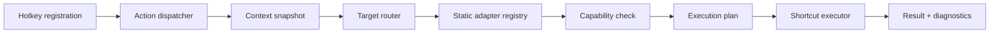
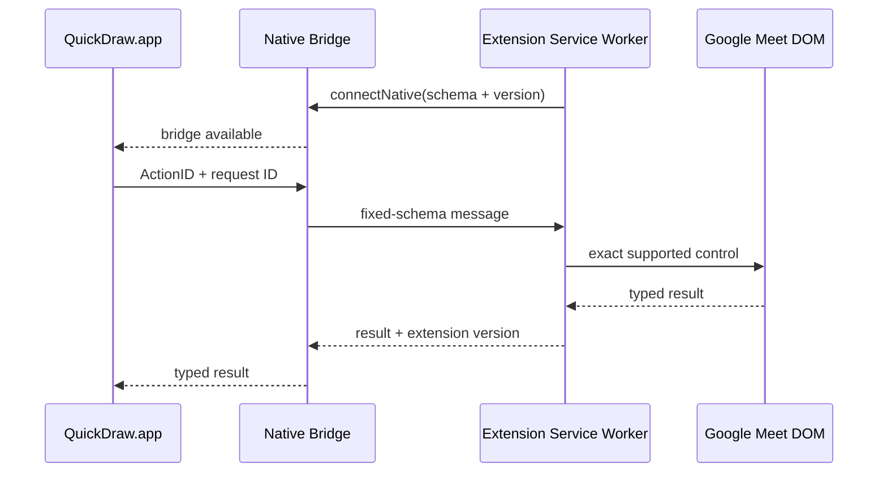

# QuickDraw プロダクト・技術設計書

- ステータス: Proposed / 実装前
- 更新日: 2026-08-11
- 対象: macOS、Level 1 MVP、Level 2 validation
- UI参考: 添付の Haken 案を QuickDraw として解釈

> [!NOTE]
> 本文中の`⌘⌥`中心のTrigger例は、初期validationを説明する履歴的な例である。現在のSuggested Trigger、Meeting / Development / Browserの再整理、macOS純正設定への委譲、Finderのopt-in設計は [ショートカット設計原則とSystem / Finder opt-in設計](shortcut-design-principles.ja.md) を正本とする。

## 先に結論

QuickDraw のMVPは、次の1本の経路を確実に成立させる。

> 登録済みTrigger → Built-in Action → Foregroundの対応Target → 公式Shortcut → 静かな実行結果

推奨構成は、Swift製のDeveloper ID署名・Notarization配布アプリで、Menu Bar ExtraとmacOSネイティブな設定ウィンドウを持つ。MVPのActionは `meeting.mute`、`meeting.camera`、`meeting.raiseHand` の3つ、AdapterはTeams、Zoom、Google Meetの3つに限定する。Plugin System、Workflow Builder、Profile、Custom Action、Browser Extension、背景会議の自動検出は導入しない。

重要な判断は以下である。

1. **MVPのTargetはForegroundのみ。** 背景会議の操作は価値が高いが、プロセスが起動中というだけでは正しい会議Targetを保証できない。
2. **MVPでは修飾キーなしの英数字をGlobal Triggerにしない。** `M`、`C`、`R`、`1` は入力欄で通常入力を奪う。Fキーまたは修飾キー付きChordを使う。
3. **Level 1の成功は「コマンドを配送できた」まで。** Toggle後の実状態はアプリ内部を読まない限り保証できない。
4. **Meetのタブ認識とWeb UI実行を分離する。** Active Tab URLによるMeet判定はExtensionなしで検証し、DOM操作が必要なLevel 2だけExtensionを検討する。
5. **UIはAction-first。** Action詳細から全Application Mappingが見え、Applications画面はCapability確認用の逆引きビューとする。

### 確度ラベル

| ラベル | 意味 |
|---|---|
| **Confirmed** | Appleまたはベンダー公式資料で確認済み、あるいはインストール済みアプリのScripting Dictionaryで確認済み。 |
| **Likely** | API仕様や一般的挙動から成立可能性が高いが、対象OS・アプリ版で確認が必要。 |
| **Requires validation** | 実測結果で方式または仕様を決める。 |
| **Unsupported** | 今回意図的に非対応、または堅牢な方式がない。 |

---

## 1. Product definition

### 解決する問題

会議アプリごとに異なるキーを、ユーザーが定義した共通Actionへ揃える。

```text
⌘⌥M → Mute → Teams: ⌘⇧M / Zoom: ⌘⇧A / Meet: ⌘D
```

QuickDrawは「操作互換レイヤー」である。プロダクト思想ではIntentと説明してよいが、Domain Modelでは具体的な `Action` を使う。

### 解決すること

- 頻繁に使う共通操作を同じmuscle memoryで呼び出す。
- アプリ固有の実行方式をユーザーから隠しすぎず、確認・上書き可能にする。
- AdapterごとにShortcut、API、Apple Events、Accessibilityなど最適な方式を選ぶ。
- 将来のStream Deck等がApplicationではなくActionを発火できる境界を残す。

### 解決しないこと

- 汎用Automation、Macro Recorder、Workflow Builder、AI Agentにはしない。
- Karabiner-Elements、Keyboard Maestro、Apple Shortcutsを置き換えない。
- 座標クリックを大量に定義しない。
- Shortcut配送だけでMute等の実状態を保証しない。
- すべてのCommandを物理キーへ割り当てない。

### Karabiner-Elementsとの違い

| | Karabiner-Elements | QuickDraw |
|---|---|---|
| 中心概念 | Physical key/event | Semantic Action |
| 変換 | Key → Key/Modifier | Trigger → Action → Application execution |
| Context | Device/Application/Event rule | Application/Web Application Capability |
| 出力 | 主にKeyboard Event | Shortcut/API/Apple Event/AX/Extension等 |
| 関係 | 任意の入力レイヤー | 単体動作する互換レイヤー |

Karabinerとの併用時も、KarabinerがQuickDrawのTriggerまたは外部Action APIを呼ぶだけで、依存関係は持たせない。

### Level 1 / 2 / 3

| Level | UX | 技術 | 状態 |
|---|---|---|---|
| 1 Shortcut Translation | Direct Trigger | 公式Shortcut中心 | MVP |
| 2 Semantic Adapter | Direct Trigger | Appごとに異なる実行方式 | 次期validation |
| 3 Complex Commands | Command Palette | 低頻度・状態依存・複数手順 | Scope外 |

Levelは実装方式そのものではなく、プロダクト上の複雑さを表す。Zoom Reactionには公式Shortcutがあるが、Teams/Meetとの横断機能としてはLevel 2に置く。

### Chat / Share / Leaveの分類提案

| 操作 | 提案 | 理由 |
|---|---|---|
| Chat表示 | **Level 2** | Zoom/Meetは公式Shortcutあり。Teams macOSの同等なin-meeting toggleは今回の公式資料で確認できない。 |
| 画面共有 | **MVP後のLevel 1候補** | Action名は `openSharePicker` とする。Teamsはtray、Meetはpresenting flow、Zoomはstart/stopで意味が完全一致しない。 |
| 会議退出 | **Level 2・safety-sensitive** | 破壊的で誤発火コストが高く、Shortcutの意味も不統一。opt-inと確認、またはCommand Paletteが適切。 |
| Recording / Breakout Room | **Level 3** | Role・状態依存、低頻度、複数手順。 |

---

## 2. Primary user journeys

### 初回起動

1. 「1つのActionを複数アプリへ変換する」と短く説明する。
2. 3つのBuilt-in Actionと検出済みApplicationを表示する。
3. Triggerを割り当てる。現在のvalidationは`⌘⌥`+英字／数字を使用するが、将来のSuggested Triggerは[ショートカット設計原則](shortcut-design-principles.ja.md)に従い、Actionの意味とTarget種別で配置する。
4. 必要になるPermissionと理由を事前表示する。この時点では一括要求しない。
5. 「QuickDrawを有効にする」でLevel 1に必要なPermissionを案内し、Foregroundの対応アプリでTestする。
6. Windowを閉じてもMenu Barで常駐する。

「後で設定」を許可し、Trigger登録と出力が安全に成立するまではDisabledとする。

### 権限設定

- Level 1のevent postingにAccessibility相当が必要かはP0で確定し、必要ならEnable時に説明して要求する。
- Chrome/Safari AutomationはMeetを有効化またはTestした時だけBrowserごとに要求する。
- Input MonitoringとScreen RecordingはMVPで要求しない。
- Permission画面にはStatus、利用理由、影響機能、System Settingsを開く、再確認を用意する。

### Action設定 / Trigger assignment

MVPではActionを自由作成しない。Built-in Actionを選び、EnabledとTriggerを編集する。

Trigger Recorderは以下を行う。

- Fキー、またはCommand/Control/Optionを含むChordを受理する。
- bare letter/digit、Space、Return、Escape、Tabを拒否する。
- 既知のSystem Shortcutを警告し、登録失敗を保存前に示す。
- keyCodeとmodifierを正規化し、表示用の表記を分離する。
- Restore Suggested Trigger / Clearを提供する。ClearしたTriggerはグローバル登録とShortcut Guideから除外する。

### Application mapping

Action `Mute` の詳細で次のように見せる。

```text
Mute                                      ⌘⌥M  Enabled
──────────────────────────────────────────────────────
Microsoft Teams   Supported · Shortcut    ⌘⇧M  Default
Zoom              Supported · Shortcut    ⌘⇧A  Default
Google Meet       Supported · Shortcut    ⌘D   Default
```

各行にApplication identity、Execution Method、確度、Permission、最終Test結果、User Overrideを表示する。Override編集はAdvanced disclosure内に置き、Defaultへ戻せるようにする。

### 実利用

1. 対応ApplicationまたはMeet TabをForegroundにする。
2. 登録済みTriggerを押す。
3. Context → Target → Adapter → Capabilityを解決し、公式Shortcutを配送する。
4. 成功時は原則無表示。Menu Barが短時間だけ配送済み状態を示してもよい。

MVPでは背景アプリを一時的に前面へ出したり、Spaceを切り替えたりしない。

### Browser routing

1. ChromeまたはSafariがForeground。
2. 前面WindowのActive Tab URLだけを取得する。
3. HTTPSかつhostが `meet.google.com` の場合だけGoogleMeetAdapterへrouteする。
4. 同じActive Tabへ公式Meet Shortcutを配送する。
5. URL取得拒否、Private Window、別host、途中のtab切替はfail closedにする。

履歴、全Tab一覧、page text、URL path/queryは収集・保存しない。

### Error / unsupported

- 非対応Foreground App: defaultではsilent、Menu Barに「対応Targetなし」。
- Capabilityなし: failure feedbackを有効にしたユーザーだけsubtle HUD。
- Permission不足: 1 session・1 permissionにつき一度だけ案内し、連続通知しない。
- Vendor側Shortcut変更: Mapping Overrideの確認を促す。
- Meeting外でShortcutが無効: 「Delivered / effect unknown」と記録する。
- Adapter連続失敗: `Needs attention` とし、継続retryしない。

---

## 3. Information architecture

### App shell

**Menu Bar Extra + 設定用Window**を採用する。

- Menu Bar: Enabled、Detected Target、Open QuickDraw、Diagnostics、Settings、Quit。
- Window: Action/Capabilityを編集・確認する場所。
- 通常時はDock icon不要。Windowを開く時は通常のactive windowとして振る舞う。
- Launch at Loginは明示的な設定にする。

| 方式 | 長所 | 問題 | 判断 |
|---|---|---|---|
| Normal Window App + Menu Bar | 発見しやすく標準的 | 常駐UtilityとしてDock/Windowの存在感が強い | 初回導線の考え方だけ採用 |
| Menu Bar中心 + Settings Window | 常駐時に静か、必要時だけ十分な編集面 | MenuだけではAction Mappingを編集できない | **採用** |
| Menu Bar only | 最小 | CapabilityやPermissionを説明する面積が不足 | 不採用 |

### Window structure

macOS標準の3カラムを使う。

1. Sidebar: Actions / Applications / Diagnostics
2. Content: Action listまたはApplication capability list
3. Inspector: 選択対象の詳細。狭いWindowでは自動的に閉じる。

添付案のDashboard、Mapping、Actionsは同じ関係を重複表示しているため統合する。Settingsは標準の `⌘,` で開き、Sidebarに重複配置しない。

### Actions

- Primary view。初期選択。
- Toolbar: Inspector Toggle。
- Sidebar Footer: Global状態、Trigger数、Global Enable Toggle。
- Row: Action、Trigger、Application/Capability summary、Status。
- MVPでは3行だけなのでCard Gridにしない。

### Inspector

- Action名、説明、Enabled。
- Trigger Recorder。
- Teams/Zoom/MeetのExecution Row。
- Advanced内にShortcut OverrideとReset。
- 現在のTargetへTest。実行不能時はdisabled reasonを表示する。

### Applications

Application identityを保つ逆引き画面とする。

- 名前、monochrome icon、bundle/browser identity。
- Installed / Running / Active。
- ActionごとのCapability matrix。
- Setup requirementとlast test。
- Application-firstのShortcut authoringは置かない。

### Menu Bar

```text
QuickDraw                     ✓ Enabled
Target                        Google Meet — Chrome
─────────────────────────────────────────
Disable QuickDraw
Open QuickDraw…
Diagnostics…
Settings…
Quit QuickDraw
```

MVPではAction実行一覧やCommand Launcherを詰め込まない。

### Settings

- General: launch at login、menu bar、failure feedback。
- Permissions: purpose、status、test、System Settings link。
- Browsers: enabled browser、Active Tab privacy behavior。
- Advanced: diagnostics retention、reset、version。

---

## 4. Domain model

### `ActionDefinition`

- `id`: brand-neutralで安定したID。例 `meeting.mute`。
- `nameKey` / `descriptionKey`: localization key。
- `symbolName`: SF Symbolまたはmonochrome asset。
- `behavior`: `toggle` / `command`。観測状態ではなく説明用。
- `level`: catalog metadata。
- `safety`: normal / disruptive / destructive。

MVPは `meeting.mute`、`meeting.camera`、`meeting.raiseHand`。Reactionは `meeting.reaction.like` 等とする。

Built-inと将来のUser-defined Actionは同じ読取モデルで表示するが、出所を分ける。Built-in IDはCatalogが所有し意味を変更不可、Custom Actionは `user.<UUID>` のような衝突しないIDを持ち、少なくとも1つの明示Mappingが必要になる。MVPではCustom Actionの作成・import・共有を一切出さない。

### `Trigger` / `TriggerBinding`

`Trigger` はApplication非依存の正規化入力で、source kind、key code、modifier、display representation、repeat policyを持つ。MVP sourceはkeyboardだけでauto-repeatは無視する。

`TriggerBinding` がTriggerとActionIDを結ぶ。Action自体にTriggerを埋め込まない。将来ProfileやInput SurfaceがBindingを所有できる。

### `ApplicationDescriptor`

- `ApplicationID`: `microsoft.teams`、`zoom.workplace`、`google.meet`。
- native bundle identifier群またはweb host matcher。
- display name、monochrome icon。
- target kind: nativeApplication / webApplication。

ブランド名はCatalog Dataに閉じ、Action IDやRouting boundaryには含めすぎない。

### `ApplicationAdapter`

Adapterの責務は1 ApplicationIDについてCapabilityを宣言し、Action/Target/ContextからExecution Planを作ることだけ。

```text
applicationID
capability(action, context) → Capability
makeExecutionPlan(action, target, context) → Plan or Reason
```

Input監視、Persistence、UI、Permission promptは所有しない。MVPでは小さな1 interfaceに留め、機構ごとのProtocol乱立を避ける。

### `Capability`

AvailabilityとMethodを分ける。

- availability: supported / requiresSetup / experimental / temporarilyUnavailable / unsupported
- method: shortcut / officialAPI / urlScheme / appleEvent / accessibility / browserExtension
- confidence: confirmed / likely / requiresvalidation
- required permissions、reason、source version、override可能値

UIでは `Supported · Shortcut`、`Requires extension · Browser` のように組み合わせて表示する。

### `ExecutionPlan` / `ExecutionCommand`

短命なimmutable valueとしてTarget、ActionID、Adapter ID、Command列、timeout、期待するresult semanticsを持つ。MVPは1つのShortcut Commandだけ。Level 2で複数Commandが必要でも、汎用Workflow Graphにはしない。

### `RoutingContext` / `Target`

Trigger時点で以下をsnapshotする。

- Foreground app bundle ID / PID。
- 必要時だけBrowser active-tab classification。
- Permission snapshot、Enabled、monotonic timestamp。
- 将来のsession/pinned target fact。

Targetは `nativeApplication(pid, applicationID)` または `webApplication(browserPID, browserID, applicationID, shortLivedTabToken)`。raw URLは保持しない。

### Profile

**MVPにProfile Entityを導入しない。** Schema-version付きroot configurationがTriggerBinding配列を持つ。将来ProfileがBindingを所有する形へ移せるため、未使用Entityを先行実装する必要はない。

---

## 5. Execution architecture



### Keyboard input

当初はHIToolbox/Carbonの `RegisterEventHotKey` を採用したが、対象外アプリでもTriggerを消費するため、現在の実装は `CGEventTap` を薄い `HotKeyRegistrar` に隔離して使う。

- 設定済みのkeyCodeとmodifierだけを照合し、その他のイベントは変更せず即座に返す。
- 対応アプリ／Meetタブでだけイベントを消費し、対象外ではmacOSと前面アプリへ素通しする。
- QuickDraw生成イベントはsource markerで除外し、再発火を防ぐ。
- macOS標準カタログ、System Settingsのbest-effort読取、event tap生成結果を分けて競合状態を表現する。

**Confirmed in validation /継続検証:** current macOSでのmodifier chord、repeat、source marker、対象外passthrough。Permission、secure input、sleep/wakeは継続して実機検証する。

### Routing flow

1. GlobalまたはBindingがdisabledなら終了。
2. `NSWorkspace` からForegroundをsnapshot。
3. Teams/Zoom bundle IDならnative Target。
4. Enabled browserなら前面Active Tabだけを読みhost分類。
5. Static Adapter Registryから解決。
6. CapabilityとPermissionを検査。
7. Planを一度だけ実行。
8. Redacted resultを記録。

Level 1 hot pathではnetwork access、AX tree探索、pollingを行わない。

### Application detection / Target routing

| 方針 | 評価 | MVP |
|---|---|---|
| Foreground only | 高信頼・説明可能。会議へfocusが必要 | **採用** |
| Meeting session detection | UX価値は高いがvendor依存・誤検出リスク | 後続validation |
| User-selected / pinned target | 明示的。ただし背景Shortcut配送自体を検証要 | Phase 1.1 |
| Action-specific routing | 強力だが設定が複雑 | Future |
| Context-aware routing | 隠れた判断が増える | 十分な診断実績後 |

QuickDrawが会議アプリを一瞬Activateして戻す方式は禁止する。Focus theft、Animation、Space切替、入力喪失、raceを生むためである。

### Command execution

公式Shortcutのmodifier/key-down/key-upを生成し、QuickDraw固有source markerを付けて配送する。Input layerはmarker付きeventを無視し、再帰を防ぐ。

`CGEvent.post`、`postToPid`等のどれが最も堅牢か、Accessibility/Post Event Permissionがどの条件で必要かは**Requires validation**。Clean machine実測前に「Accessibility不要」と宣伝しない。

### 実行方式の優先順位

元の候補順位は「公式Shortcutという契約」と「配送技術」が混在するため、以下へ整理する。

1. 同一Actionを直接行うdocumented local official API/native command。
2. 解決済みTargetへdocumented official shortcutを配送。
3. Exact semanticsを持つdocumented URL Scheme / Apple Event。
4. 一意に識別できるsemantic menu item invocation。
5. Semantic Accessibility element action。
6. Web内部操作のBrowser Extension。
7. Focus移動を伴うkeyboard navigation sequence。
8. Coordinate/image based automation — default unsupported。

Web Applicationでは、Browserを跨ぐAX探索よりorigin限定Extensionの方が堅牢な場合がある。これは絶対順位でなくContext別decision treeとする。

### Failure handling

Resultは `delivered`、`noTarget`、`unsupportedAction`、`permissionRequired/Denied`、`targetChanged`、`executionRejected`、`executionTimedOut`、`adapterOutdated`、`configurationConflict` を持つ。

`delivered` はevent/APIが受理された意味で、実状態成功の保証ではない。Successはsilent、actionable failureだけnonactivating HUDまたはrate-limited notification、すべてDiagnosticsへ残す。

---

## 6. Adapter architecture

Adapterは静的に組み込み、dynamic plugin、script、downloaded executableにはしない。

### Level 1 mapping catalog

| Action | Teams for Mac | Zoom Workplace for Mac | Google Meet on Mac |
|---|---|---|---|
| `meeting.mute` | `⌘⇧M` | `⌘⇧A` | `⌘D` |
| `meeting.camera` | `⌘⇧O` | `⌘⇧V` | `⌘E` |
| `meeting.raiseHand` | `⌘⇧K` | `⌥Y` | `⌃⌘H` |

Mappingは現在の公式資料で**Confirmed**。

- [Microsoft Teams keyboard shortcuts](https://support.microsoft.com/en-us/accessibility/teams/keyboard-shortcuts-for-microsoft-teams)
- [Zoom hot keys and keyboard shortcuts](https://support.zoom.com/hc/en/article?id=zm_kb&sysparm_article=KB0067050)
- [Google Meet keyboard shortcuts](https://support.google.com/meet/answer/9298571?hl=en-GB)

Vendor側でcustomize/updateされるため、Catalog version/sourceとUser Overrideを持つ。

### TeamsAdapter

Level 1:

- 実在bundle ID群をvalidationで記録する。
- 3つの公式Shortcutを宣言する。
- TeamsがForegroundの時だけ配送する。
- Electron AX treeは探索しない。

Level 2:

- Meeting Window内のReaction entry/buttonをAccessibilityで探索する。
- AXIdentifier、role/subrole、supported actionを優先し、localized labelを主キーにしない。
- 探索node数/timeを制限し、cacheは短命にする。
- invalid elementやwindow changeで即座にinvalidateする。

TeamsのAX metadata安定性は**Requires validation**。

### ZoomAdapter

Level 1は公式3 Shortcut。QuickDraw Overrideを許可し、Zoom preference解析は必要性が出るまで行わない。

Level 2 Reactionは現行公式Shortcutを利用できる。

- Clap `⌥⌘4`
- Thumbs Up `⌥⌘5`
- Heart `⌥⌘6`
- Joy `⌥⌘7`
- Celebrate `⌥⌘9`

Shortcut存在は**Confirmed**、account policy、locale、layout、custom settingを含む安定性は**Requires validation**。

### GoogleMeetAdapter

Browser identityとWeb Application identityを分ける。

- BrowserContextProvider: short-lived active-tab classification。
- GoogleMeetAdapter: Meet CapabilityとExecution Plan。

Level 1:

- Active HTTPS tabのhostがexactly `meet.google.com` の時だけroute。
- 配送直前にForeground browser/windowを再確認する。
- 公式Meet Shortcutを使う。

Level 2:

1. Web contentにstable AX identifier/actionが見えるか検証。
2. Reliability gateを満たさなければ `https://meet.google.com/*` 限定Extension。
3. ExtensionはAction allowlistだけを扱い、arbitrary JavaScriptを受け付けない。
4. Native MessagingはAction IDとtyped resultだけを渡す。

### Capability表示例

| Adapter / Action | Availability | Method | Confidence |
|---|---|---|---|
| Teams / MVP 3 Actions | Supported | Shortcut | mapping confirmed / delivery validation |
| Zoom / MVP 3 Actions | Supported | Shortcut | mapping confirmed / delivery validation |
| Meet / MVP 3 Actions | Requires browser setup | Shortcut | mapping confirmed / route validation |
| Zoom / Reactions | Experimental | Shortcut | behavior validation |
| Teams / Reactions | Experimental | Accessibility | Requires validation |
| Meet / Reactions | Experimental | AX or Extension | Requires validation |

---

## 7. macOS API investigation

### Technology recommendation

- Swift。
- SwiftUI: Sceneと大部分の設定UI。
- AppKit: Window挙動、nonactivating feedback、Application activation、SwiftUI gap。
- Observation: presentation state。
- async/await: Browser query、Permission check、bounded executor。Hotkey callback自体では重い処理をしない。
- Rust、helper daemon、privileged helperはMVPで不採用。

### API matrix

| 領域 | API | 判断 |
|---|---|---|
| Global Hotkey | `CGEventTap` | **Confirmed in validation。** 設定済みTriggerだけを条件付きで消費し、その他は素通し。 |
| Foreground App | `NSWorkspace.frontmostApplication`、activation notifications | **Confirmed。** event-driven。 |
| Input monitor | `NSEvent` global monitor | 不採用。modify不可で、広いkey観測が不要。 |
| Input interception | `CGEventTap` | Triggerのコンテキスト限定消費に必要。キー内容は保存せずsource marker付き出力を除外。 |
| Shortcut output | `CGEvent` keyboard event / post variants | **Requires validation。** APIはConfirmed、TCC/Target挙動は実測。 |
| Accessibility | `AXUIElement`、`AXUIElementPerformAction`、AX notification | Level 2。APIはConfirmedだがtimeout/failure前提。 |
| Apple Events | Apple Event Manager / ScriptingBridge | Browser active tab metadataだけに限定。 |
| Browser identity | Browser Scripting Dictionary | Installed Chrome/Safariでactive/current tab URLを**Confirmed**。Runtimeはvalidation。 |
| URL Scheme | `NSWorkspace.open` | Meeting toggleには不適。将来external Action invoke候補。 |
| Menu invocation | AX menu + `kAXPressAction` | Level 2 fallback。locale/dynamic menuに注意。 |
| Login item | `SMAppService.mainApp` | macOS 13+で**Confirmed**。helper不要。 |
| Menu bar | SwiftUI `MenuBarExtra` | **Confirmed**。小さいpull-down menu。 |
| Logging | `os.Logger` | **Confirmed**。privacy annotation利用。 |

Apple資料:

- [NSWorkspace frontmostApplication](https://developer.apple.com/documentation/appkit/nsworkspace/frontmostapplication)
- [NSWorkspace activation notification](https://developer.apple.com/documentation/appkit/nsworkspace/didactivateapplicationnotification)
- [CGEvent](https://developer.apple.com/documentation/coregraphics/cgevent)
- [AXUIElementPerformAction](https://developer.apple.com/documentation/applicationservices/1462091-axuielementperformaction)
- [MenuBarExtra](https://developer.apple.com/documentation/swiftui/menubarextra)
- [SMAppService](https://developer.apple.com/documentation/servicemanagement/smappservice)

### Browser Active Tab

- Chrome: `window.active tab` と `tab.URL` をlocal Scripting DictionaryでConfirmed。
- Safari: `window.current tab` と `tab.URL` をConfirmed。
- Edge/Arc/Firefox: heritageから推測せずMVP Unsupported。
- Private/Incognito: privacy/behavior validation完了までUnsupportedをdefaultとする。

前面Browserの前面Windowだけを100ms目標のtimeoutで問い合わせる。全Tab列挙をしない。取得後はscheme+hostだけで判定し、path/query/fragmentを破棄する。

### ScriptingBridge vs raw Apple Events

ScriptingBridgeは読みやすいがgenerated interface/build dependencyが増える。Raw descriptorは2 propertyだけなら小さいがerror-prone。validationで比較し、Browser-specific gateway一箇所へ隔離する。shellから `osascript` を起動する方式は採用しない。

### Application-specific API / URL Scheme / Menu

今回確認した公式資料からは、Teams/Zoom/Meetの「参加者自身のMute/Camera/Hand Raise」をmacOS上で直接操作するdocumented local APIは確認できていない。Meeting SDKやCloud APIが存在しても、既存ClientのForeground操作を低遅延で置き換える契約とは限らないため、MVP候補として理想化しない。URL Schemeもjoin/open用途とin-meeting Actionを分け、exact commandが公式に文書化された場合だけ採用する。

他ApplicationのMenu ItemをQuickDrawから直接 `NSMenu` として呼ぶことはできない。Level 2でMenuを使う場合はAccessibility経由で対象Menu Itemを一意に特定し `kAXPressAction` を実行する。Localized titleしか識別子がない場合はExperimental扱いとする。

### Distribution / Sandbox

MVPはMac App StoreではなくDeveloper ID + Notarizationを推奨する。App SandboxはMac App Store必須で、他AppへのApple Eventsはscripting-target/temporary exception制約を受ける。入力・event posting・複数App制御の成立確認前にStore要件を優先しない。

ただしsingle unprivileged user process、Hardened Runtime、署名、Notarization、最小TCC permissionを守る。

---

## 8. Permissions design

| Permission | 理由 | Level | Request timing | ない場合 | 判断 |
|---|---|---|---|---|---|
| Accessibility / Post Event | Synthetic Shortcut配送。Level 2 AX操作 | L1 likely / L2 definite | Enable時、説明後 | 設定のみ可、実行不可 | L1必要性をclean-machine validationで確定 |
| Input Monitoring | Global key/mouse監視 | advancedのみ | MVPでは要求しない | Intended hotkey方式には影響しない想定 | **MVP不使用** |
| Automation — Chrome/Safari | Active Tab URLを読む | Meet L1 | Browser enable/test時 | Teams/Zoomは動作、Meet不可 | delayed / per-browser |
| Screen Recording | Pixel capture | none | never | 影響なし | **不使用** |
| Notifications | Optional failure notice | optional | user opt-in時 | HUD/Menu diagnosticsを使う | delayed |
| Full Disk Access | 不要 | none | never | 影響なし | **Unsupported** |

Appleの説明に合わせ、Input Monitoringは「入力を見る」、Accessibilityは「Macを制御」、Automationは「他Appを制御」と明示する: [Privacy & Security settings](https://support.apple.com/guide/mac-help/change-privacy-security-settings-mchl211c911f/mac)。

Denied時はprompt loopを作らずMappingを保持し、影響Capability、Open System Settings、Check Againを表示する。他Adapterは継続動作し、別Browserへ勝手にPermission要求しない。

---

## 9. Persistence design

| 方式 | 長所 | 短所 | MVP |
|---|---|---|---|
| UserDefaults | scalar preferenceに最適 | versioned mapping graphやrecoveryに弱い | 小設定だけ |
| Versioned Codable file | 透明、test/export/atomic replaceが容易 | migration実装が必要 | **Binding/Overrideに採用** |
| SwiftData | relationship/query/migration | 3 Actionには過剰 | defer |

### 保存分離

UserDefaults:

- global enabled、launch at login mirror、failure feedback、onboarding version、UI selection。

Application Supportの `configuration.json`:

- schema version、TriggerBinding、未割り当てTrigger、per-app shortcut override、enabled app/browser、future profile-ready root。

Bundled Catalog:

- Built-in Action、Application Descriptor、default Capability/Mapping、catalog version/source。

Writeはtemporary encode → atomic replace、last-known-good backupを持つ。不正fileは即上書きせずsafe defaultsでExecutionを無効化し、recovery/exportを出す。Repository層やDBは作らず `ConfigurationStore` 1境界でよい。

---

## 10. UI specification

### 添付案から残すもの

- Action → Applicationsの関係が一目で分かる。
- Trigger badge。
- Application identity。
- 選択Actionのdetail。
- Monochrome utilityのtone。

### 改善するもの

- Dashboard/Mapping/Actions重複を削除。
- MVP 3 Actionに合わせて情報密度を下げる。
- Custom glass cardではなくnative list/separator/toolbar/sidebar/inspector。
- Global settingはcontent headerでなくstandard Settings/Menuへ。
- 未実装のProfile/History/Sync counterを見せない。
- Purple等の独自accentを廃し、OS Accentのみ。

### Component hierarchy

```text
ConfigurationWindow
├─ Toolbar(InspectorToggle)
├─ SidebarFooter(GlobalStatus, TriggerCount, GlobalEnable)
└─ NavigationSplitView
   ├─ Sidebar(Actions, Applications, Diagnostics)
   ├─ ActionList
   │  └─ ActionRow(Action, Trigger, Capability summary, Status)
   └─ Inspector
      └─ ActionDetail
         ├─ Header
         ├─ TriggerEditor
         ├─ ApplicationExecutionList
         └─ Test / Advanced
```

### Visual rules

- System materialとstandard controlを使い、全rowをcustom translucent cardにしない。
- Liquid Glass世代ではsystem sidebar/toolbar/menu/inspectorのappearanceに追従する。
- 旧対応OSではGlassを模倣せずstandard materialへfallback。
- Semantic colorを使い、redはdestructive actionのみ。
- Sidebar icon/selectionはOS Accent / Highlight Color。
- Applicationはmonochrome template icon + name。形だけに依存しない。
- ActionはSF Symbols中心。Climbing motifはApp icon/Aboutに限定。
- Light/Dark、Increase Contrast、Reduce Transparency/Motion、Keyboard navigation、VoiceOver対応。

Apple HIGもLiquid Glass上のSidebarとuser accent尊重を推奨する: [HIG — Sidebars](https://developer.apple.com/design/human-interface-guidelines/sidebars)。

### State

| State | UI |
|---|---|
| Empty Trigger | `Not assigned` + Assign Trigger。Action情報は見える。 |
| No selection | 選択案内。Marketing dashboardにしない。 |
| Loading | Explicit Test時だけinline progress。Idle listにspinnerなし。 |
| Permission | reason + Open System Settings + Check Again。 |
| Unsupported | muted row + reason。動かないedit UIを出さない。 |
| Requires setup | semantic amber +具体的action。 |
| Experimental | beaker label + last tested app version。 |
| Error | InspectorとDiagnostics。red乱用なし。 |
| App not installed | rowを残し `Not installed`。 |
| Globally disabled | Menu Bar/Sidebar Footerで明示し、編集は可能。 |

Action画面だけで「何をする／何を押す／どのApp／どう実行／何が不足」を回答できることをUI acceptanceとする。

---

## 11. MVP definition

### Included

- macOS native menu bar utility + configuration window。
- Built-in Action: Mute、Camera、Raise Hand。
- Teams desktop、Zoom Workplace desktop、合意したBrowser上のGoogle Meet。
- Actionごとにkeyboard Trigger 1つ。
- Foreground-only routing。
- Official default shortcut + manual override/reset。
- Capability/Permission/Application visibility。
- Redacted diagnostics、safe unsupported handling。
- Launch at Login control。

### Non-goals

- Reaction、Chat、Share、Leave、Recording、Breakout Room。
- Background session detection、Pinned Target。
- Profile、Custom Action、Command Palette。
- Browser Extension、Native Messaging。
- Stream Deck、CLI、URL Scheme、Local API。
- Shortcut auto-discovery、Meeting state同期。
- Bare alphanumeric global trigger。

### Success criteria

1. 3 Actionすべてでsafe Triggerをassign/clear/validate/persistできる。
2. Teams、Zoom、active Meet tab、unsupported foregroundを誤推測なく区別できる。
3. 9つのAction × Application routeが対象versionでdocumented shortcutを配送する。
4. Native route内部latency p95 ≤ 25ms / 100回。Network不使用。
5. Idle 5分後はpollingなし、平均CPU目標 <0.2%、resident memory目標 <80MB。
6. InspectorでApp名、Availability、Method、Shortcut、Permission、Last Testが分かる。
7. Permission denial、tab change、unsupported app、registration conflictでstray typing、focus theft、crashがない。
8. 一般キー入力を記録せず、Browser URLはhost-level diagnostic以上にpersistしない。
9. Routeごと30回連続実行とApp/Tab切替でduplicate/stuck modifierがない。

Reaction成功はMVP条件に含めない。

---

## 12. Level 2 design

### Reaction catalog

- `meeting.reaction.like` 👍
- `meeting.reaction.heart` ❤️
- `meeting.reaction.clap` 👏
- `meeting.reaction.laugh` 😂
- `meeting.reaction.celebrate` 🎉

✋をdevice上に表示してもRaise Handは `meeting.raiseHand` で、Reaction aliasにはしない。

### App別方式

| Target | 第一候補 | fallback | 境界 |
|---|---|---|---|
| Zoom | Official reaction shortcuts | 必要時semantic AX | policy/layout/custom settingをvalidation |
| Teams | Semantic Accessibility | 初期はなし | element identityとupdate耐性がgate |
| Meet | Browser Extension + Native Messaging | Semantic Accessibility | DOM element identityとversion skewがgate |

### AX element識別

1. AXIdentifierまたはvendor-stable automation property。
2. role/subrole + supported action。
3. ancestor/window identityと構造関係。
4. help/description/valueをlocalized catalogでnormalize。
5. localized titleは最後のfallback。

Coordinate禁止、単一depth/index path禁止、ambiguousならfail closed。Participant nameやmeeting contentを診断に含めない。

### Extension boundary

Extensionが必要になるのは**Web UI execution**であり、必ずしも**tab recognition**ではない。

Browser Extensionは独立したChrome版QuickDrawではなく、QuickDraw.appが確定したActionを実行するApplication Adapterとする。Trigger、Action設定、Routing、DiagnosticsのSource of TruthはQuickDraw.appに置き、Extension側へ重複させない。Repositoryは段階的モノレポとし、既存Swift構成を維持したままvalidation開始時に`BrowserExtension/`と共有message schemaを追加する。詳細は[ADR-0001](adr/0001-browser-extension-adapter-and-monorepo.md)を参照。



- Host permissionはMeet originだけ。
- Fixed Action allowlist。Arbitrary script禁止。
- Schema version、request correlation、bounded timeout。
- Page content、chat、participant dataをNative側へ返さない。
- Optional installでCapability単位に要求する。

Native Messagingはbrowserごとのmanifest、sign/install、store review、version skewが増える。Level 1は既存Shortcut経路を維持し、ExtensionはMeet ReactionなどDOM accessが必要なCapabilityだけに採用する。

---

## 13. Future roadmap

### Phase 1.1

- Chrome-only MVPならSafari追加。
- Focus theftなしのPinned Target/background execution validation。
- `openSharePicker`。
- Vendor updateに対するMapping health check。

### Phase 2

- Zoom Shortcut Reaction。
- Teams AX Reaction。
- Meet Extension/Native Messaging Reaction。AXは比較baselineとfallback候補。
- 会議Contextが確実、またはdedicated hardwareの場合だけone-key reaction。

### Phase 3 — External Input Surface

DeviceはAction IDを発火し、Adapterを直接呼ばない。

| Interface | 長所 | Risk/Cost | 提案 |
|---|---|---|---|
| `quickdraw://action/...` | Stream Deck/Launcherから簡単 | Web page等からも呼べる、caller identityが弱い | opt-in + non-destructive allowlist |
| `quickdraw trigger ...` CLI | script/test向き | install/PATH/IPC | Power user向け第一候補 |
| Local HTTP API | device互換が広い | port/auth/firewall/origin | 実需要までdefer |
| XPC | native/typed/local | third-party client/signingが複雑 | Internal helper/CLI transport |

推奨はbundled CLI → authenticated XPC。URL Schemeは安全なAction allowlistだけ後続追加する。

### Phase 4 / 5

- Slack/Discord/Spotify/YouTube/Developer toolsはshared Action需要のあるものだけbuilt-in Adapter追加。
- Custom ActionはBuilt-in編集UXが検証できてから。
- ProfileはTrigger set競合が実在してから。Auto switchよりexplicit selectionを先にする。
- Command PaletteでLevel 3を検索実行し、Level 1/2も検索可能にする。

---

## 14. Risks / unknowns

| Risk | Impact | Likelihood | Confidence | Mitigation |
|---|---|---|---|---|
| Synthetic Shortcutが不安定/広いPermission必要 | Level 1 blocker | Medium | Requires validation | Clean-machine P0をUI実装前に実施 |
| Teams/Zoom custom shortcut | silent wrong behavior | High | Confirmed | manual override/reset、diagnostics |
| Meeting外でtoggle配送 | no effect/別command | Medium | Likely | foreground + Test、successをDeliveredと表現 |
| Meet Apple Event遅延/拒否 | Meet unavailable | Medium | Requires validation | delayed permission、100ms timeout、fail closed |
| Detection後にTab変更 | wrong pageへ入力 | Low/Medium | Requires validation | 配送直前revalidation |
| Private mode metadata | privacy trust loss | Medium | Unknown | default unsupported |
| Teams Electron AX変更 | Reaction破損 | High | Requires validation | semantic identity、versioned health、fail closed |
| Meet DOM/AX変更 | Reaction破損 | High | Requires validation | measured gate後だけExtension |
| Bare keyがtypingを奪う | severe UX | High | Confirmed by design | MVP unsupported |
| 背景会議が本来の中心需要 | MVP value制限 | High | Product risk | Level 1直後にPinned Target validation |
| Sandbox/App Store制約 | distribution delay | Medium | Requires review | Developer ID first |
| Brand/icon rights | public release risk | Low/Medium | Unknown | 名称識別中心、公開前legal review |
| QuickDraw名称変更 | migration cost | Medium | Known | brand-neutral ID/schema/service boundary |

最大のProduct Riskは、Foreground-only MVPが技術成立を証明しても、会議中にVS Codeを操作する本来の利用場面を十分満たさないこと。MVPのviability milestoneとしてのみ許容し、Phase 1.1でPinned Targetを優先する。

---

## 15. validation plan

validationはProduct Code開始ではなく、破棄可能なLab Targetとする。OS/App version、Permission state、結果、latency、failure behaviorをmatrixで残す。

### P0 — UI実装前のGo/No-Go

1. **Hotkey capture permission matrix**
   - Clean accountで`⌘⌥` chordを監視。
   - Conflict、repeat、sleep/wake、secure text、layout、一般キー非観測を確認。
   - Pass: accepted trigger policyがInput Monitoringなしで安定callback。

2. **Synthetic shortcut delivery**
   - harmless test app → Teams/Zoomの順でsession post/PID postを比較。
   - Accessibility/Post Event permission、focus要否を記録。
   - 100回、duplicate、stuck modifier、source markerを検証。
   - Pass: valid meetingで各route 99/100以上、focus theftなし。

3. **Foreground identity**
   - Teams/Zoomの実bundle ID、main/meeting/floating window挙動を記録。
   - Pass: Foreground時にdeterministic adapter selection。

4. **Meet browser route**
   - Chrome first。MVP対象ならSafariも。
   - Active TabだけのApple Event、prompt/deny/private/multi-window/Spaces/tab race/100ms budget。
   - Real meetingで3 Shortcut。
   - Pass: correct host + 99/100以上、他Tabを読まない。

**Go Gate:** 9 routeすべてがpass、またはScopeを明示縮小する。Level 1にAccessibilityとInput Monitoringの両方が必要なら、UI実装前にInput/Execution方式を再設計する。

### P1 — MVP hardening

5. Teams/ZoomのShortcut customizeとQuickDraw Override/Reset。
6. Launch at login、sleep/wake、app relaunch/update、Spaces、latency、idle resource。
7. Permission denied、unsupported tab、no meeting、rapid focus switchのFailure UX。
8. Minimum OSとmacOS 26+ Liquid Glassのnative split/sidebar/inspector。

### P2 — MVP後

9. Zoom Reactionをpolicy/locale/layout/override別に検証。
10. Teams Reaction AX snapshotと100回実行、window size/locale/update差分。
11. Meet Reaction AXをChromeで比較baselineとして検証。
12. 最小Meet Extension + Native Messagingで👍だけを実行し、DOM識別、install、update、version skewを評価。

Level 2 Ship Gate: valid stateで99%以上、coordinate依存ゼロ、UI更新時にbounded failure、executable codeをdownloadしないdisable strategy。

---

## 16. Proposed project structure

以下は実装開始時の案で、現時点では作成しない。

```text
QuickDraw/
├─ Package.swift
├─ Sources/
│  ├─ QuickDrawCore/                     # Action、Routing、Catalog
│  ├─ QuickDrawShortcuts/                      # macOS App、UI、macOS gateways
│  └─ QuickDrawBrowserBridge/            # Native Messaging validation開始時に追加
├─ Tests/
│  └─ QuickDrawCoreTests/
├─ BrowserExtension/                     # Level 2 validation開始時に追加
│  ├─ package.json
│  ├─ src/service-worker/
│  ├─ src/content-scripts/google-meet/
│  ├─ manifests/chromium/
│  └─ tests/
├─ Shared/
│  ├─ browser-message.schema.json         # Native Messaging導入時に追加
│  └─ fixtures/browser-messages/
├─ Scripts/
└─ docs/
   └─ adr/
```

- 初期は1 App Target + Test。XPC helper/daemonなし。
- Browser Extension開始時も既存Swift codeを`apps/macos`へ移動せず、必要なtop-level directoryだけを追加する。
- Adapterは普通のconcrete type。2実装またはtest seamが必要になるまでProtocolを増やさない。
- Default catalogはResource、Execution logicはSwift。Runtime plugin manifestにしない。
- DI Container frameworkを使わず `AppEnvironment` で組み立てる。
- Routingはpure value fixtureでtest。Live app integrationは明示的Labで行う。
- CodenameはApp/UIに使ってよいが、Action ID/config schemaへ不要な `quickdraw` prefixを入れない。

---

## 17. Diagnostics / logging design

### Record

各Invocationにrandom request IDとmonotonic timestampを付ける。

- ActionID。
- TriggerBinding ID。一般keystreamは不可。
- Detected Application ID / bundle ID。
- Browser IDとclassified Web Target (`meet.google.com` / `mail.google.com` / `other`)。Full URL不可。
- Adapter、Execution Method、Permission state。
- Result/Error category、stage duration、catalog/adapter/app version。

### Debug Log

- `Logger` category: input、routing、browser、adapter、execution、permissions、persistence。
- Action/Application enumはpublic可。PID、path、tab token、title、raw errorはprivate/redacted default。
- Chat/page text、participant、meeting code、full URL、window title、key streamを記録しない。
- Debug buildのAX structural traceはexplicit launch flag + volatileのみ。

Apple unified loggingのprivacy annotationを使う: [OSLogPrivacy](https://developer.apple.com/documentation/os/oslogprivacy)。

### User-facing Diagnostics

- Last 100件のredacted outcomeをmemory ring buffer。defaultはQuitで消去。
- Repro用に「24時間保持」をopt-in可能。
- 表示例: `Mute → Google Meet (Chrome) → Shortcut → Delivered, 18 ms`。
- Copy Diagnostic Reportはversion、permission、capability、performance、redacted outcomesを含む。
- 保存/共有前にpreview。Auto uploadなし。

### Feedback policy

| Failure | 即時feedback |
|---|---|
| Unsupported foreground | default none |
| Missing permission | session内rate limit付きHUD/notification |
| Unsupported mapping | explicit invocation時だけsubtle HUD |
| Target changed | repeatedでなければDiagnosticsのみ |
| Adapter outdated | HUD + Menu Bar `Needs attention` |
| Persistence corruption | Window alert + Execution disabled |

成功音は出さない。Failure soundもoptionalでdefault off。Macの一般的なUtility用途で期待できるhapticは前提にしない。

---

## 18. Performance considerations

### Hot path budget

| Stage | p95 target |
|---|---|
| Trigger callback → Binding lookup | ≤2ms |
| Native foreground resolution | ≤3ms |
| Adapter/Capability/Plan | ≤2ms |
| Event construction/post request | ≤10ms |
| Total native route | ≤25ms |
| Browser detection | ≤100ms、internal total ≤150ms |

Target Applicationのvisible reaction時間はこの保証に含めない。

### Event-driven idle

- Registered hotkey callback、NSWorkspace notification、settings observation。
- Process/meeting/AX/browser pollingなし。
- Browser URLはTriggerまたはexplicit Test時だけ。
- AX searchはLevel 2 invocation時だけ。
- Diagnostics ring bufferはfixed capacity。
- Immutable Catalog/Adapter lookupをlaunch時にcache。

### Concurrency

- Hotkey callbackはconstant-time lookup後すぐhandoff。
- Action/Target単位にserializeしdouble toggleを防ぐ。
- Auto-repeatを無視し、同一Bindingを150ms程度debounce可能。
- Browser/AX operationはcancellable + timeout。
- 配送前にTargetが変わればretryせずcancel。

Release-signed buildでcold launch、first/steady p50/p95/p99、sleep/wake、CPU wakeup、resident memoryをsignpost計測する。

---

## 19. Security / privacy review

### Data minimization

- Userが登録したTriggerだけをlistenし、一般Keyboard入力を記録しない。
- Bare typing keyをMVPで禁止。
- Browserはroute時のActive Tabだけ。
- URL path/query/fragment/title/meeting codeは即破棄。
- Audio/Video/Meeting content/Chat/Participantを取得しない。
- Screen Capture/Cloud Service不要。

### Permission minimization

- Feature enable/testまでpromptを遅延。
- Browser AutomationはBrowser単位。
- Input Monitoring/Screen RecordingはMVP不使用。
- Permissionごとに取得情報と可能になるActionを説明。
- Browser Permission拒否でもTeams/Zoomは動作。

### Threat/control

| Threat | Control |
|---|---|
| Event loop/stuck modifier | source marker、strict key-up cleanup、serialized executor、watchdog test |
| Rapid switchでwrong target | immutable context + just-before-send validation |
| 将来のmalicious external invoke | MVP APIなし。将来allowlist/caller validation/rate limit/confirmation |
| Browser metadata leak | Active Tab only、host only、URL非保存、private off |
| Overpowered Extension | Meet origin、fixed Action schema、arbitrary script禁止 |
| Tampered distribution | Hardened Runtime、Developer ID、Notarization、signed update |
| Diagnostic leak | private fields、export preview、local default、bounded retention |
| Vendor update semantic break | versioned catalog、fail closed、mapping単位disable |

Telemetryはdefault none。将来opt-inする場合もAction/Application/Result/Versionのaggregateだけで、Trigger、URL、title、meeting identifier、content、participantは送らない。

User-facing privacy statementが真であることをArchitecture Acceptanceとする。

> QuickDrawは登録したShortcutだけを待ち受けます。BrowserがActiveな時はGoogle MeetやGmailなど対応Web Targetか判断するため選択中TabのSiteだけを確認します。入力内容、閲覧履歴、Meeting content、Audio、Videoは記録しません。

---

## 20. Implementation decision list

実装開始前に次の最大10項目を明示決定する。

1. **Minimum OS:** macOS 15 minimum + current SDKを推奨し、macOS 26+ではsystem Liquid Glassへ自動適応する。Pre-Liquid-Glass対応のtest costを受け入れるか。
2. **Distribution:** MVPはDeveloper ID + Notarization、Mac App Store feasibilityは後回しでよいか。
3. **Trigger policy:** bare alphanumericを拒否し、Fキーまたはmodifier chordだけを受理する。Suggested Triggerの修飾キーは一律`⌘⌥`とせず、[ショートカット設計原則](shortcut-design-principles.ja.md)に従ってActionの意味とTarget種別で決める。
4. **Input/output mechanism:** `CGEventTap`で条件付き消費し、source marker付き`CGEvent`で出力する。必要Permissionは実機matrixで継続確認する。
5. **Target policy:** MVP Foreground-onlyを受け入れ、Pinned/background targetを最優先のpost-MVP validationとするか。
6. **Meet browser scope:** Chrome-onlyをacceptance baseline（推奨）にするか、Chrome + Safariにするか。
7. **Permission promise:** P0前にLevel 1 Permissionを断定せず、Input Monitoring/Screen Recordingは要求しない方針でよいか。
8. **Mapping behavior:** Official defaults + manual override/resetとし、auto-discoveryをMVPから外すか。
9. **Persistence/UI:** Codable + UserDefaults、3 Built-in Actions、Profile/Custom Actionなし、Action-first 3-columnを採用するか。
10. **MVP Go Gate:** 9 routes、latency/resource、safe failure、diagnostics/privacyがpassするまでReactionへ進まないか。
